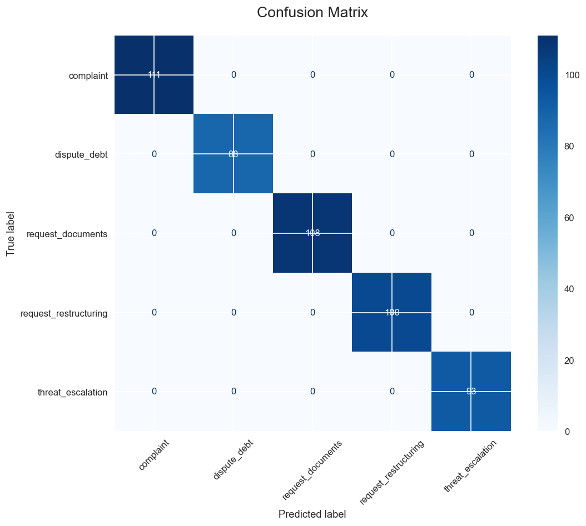
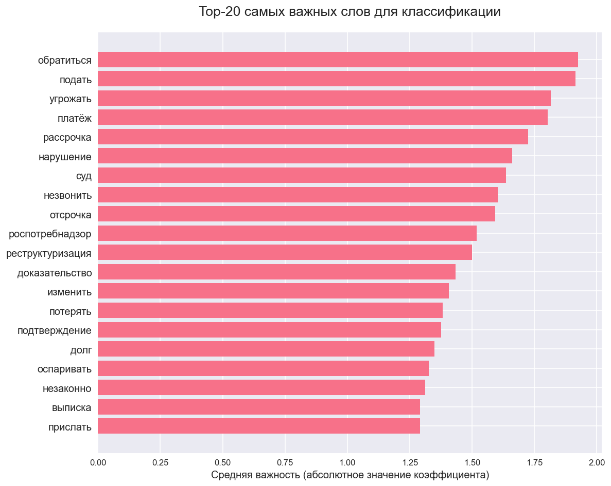
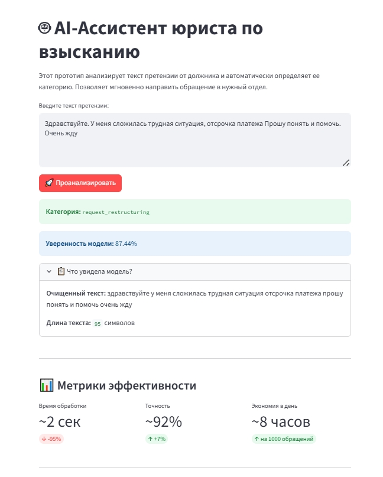

# AI-Классификатор претензий для банков

Веб-приложение на Streamlit, которое автоматически categorizes входящие обращения от должников.

## Как запустить

Установите зависимости и запустите приложение:

```bash
pip install -r requirements.txt
streamlit run app.py
```

## Демо
**Живая демонстрация приложения развернута здесь:**

👉[](https://serx17-nlp-classifier-of-email-statements-app-2teihd.streamlit.app/)

## 📊 Метрики модели и скриншоты

Модель демонстрирует высокую точность предсказания на синтетических данных. Ниже представлены результаты ее работы.

### Confusion Matrix
Матрица ошибок показывает, сколько примеров каждого класса было классифицировано правильно и неправильно. Видно, что модель уверенно предсказывает все категории.


### Важность признаков
На графике ниже показаны слова, которые сильнее всего влияют на принятие решений моделью. Это ключевые слова для каждой категории претензий.


Время обработки	     Точность (модели)	   Экономия в день
~2 сек	                ~92%	               ~8 часов
✔ -95%	                ↑ +7%	               ↑ на 1000 обращений

Модель демонстрирует высокую общую точность (Accuracy) на тестовых данных:

Accuracy (Общая точность): ~96%

F1-Score (Средняя): 0.95

### Скриншот работающего приложения

*Пример работы: классификация запроса на отсрочку платежа с уверенностью 87,44%.*


